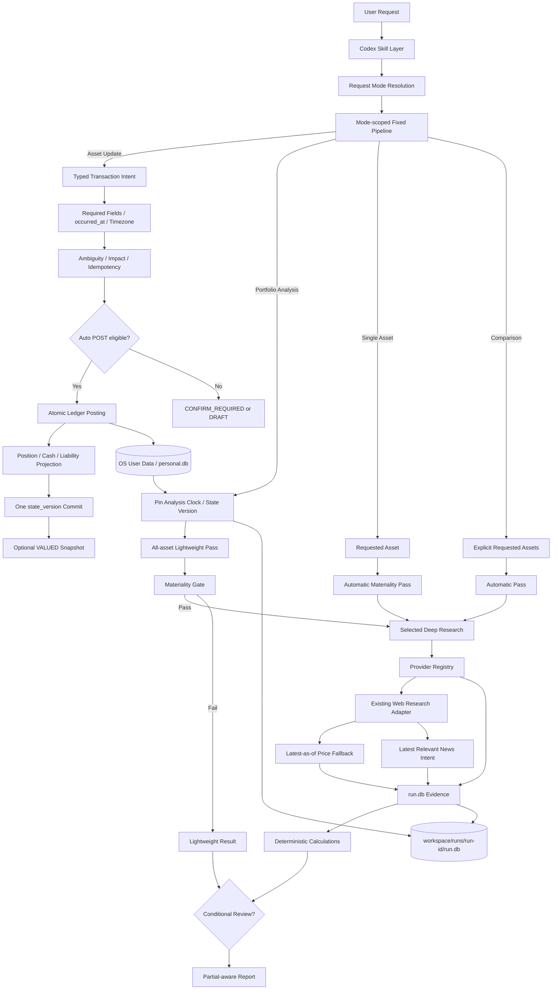

investment-stack — Canonical Final Architecture v1.3

문서 상태: ARCHITECTURE FROZEN
Critical 미해결: 0
High 미해결: 0
구현 상태: 미착수
문서 성격: 구현의 유일한 Authoritative Architecture

이 문서는 초기 Architecture, 모든 후속 수정, Grok Adversarial Review, Latest-as-of Web Research, Latest Relevant News Research 및 최종 Freeze Review를 통합한 최종 기준 문서다.

이전 Architecture 문서는 역사적 참고자료일 뿐 구현 기준이 아니다. 이후 구현은 이 문서와 명시적 Change Decision만 따른다.

1. Executive Architecture

investment-stack은 개인 투자자산의 장기 원장, 시장·기업·매크로 Evidence 수집, 자산별 분석, 포트폴리오 분석 및 전략 보고를 수행하는 Codex 전용 투자 분석 시스템이다.

핵심 구조는 다음과 같다.

Codex는 정확히 8개 Skill을 사용한다.
Python Runtime이 Provider 호출, 검증, SQLite 기록, 계산과 상태 변경을 결정론적으로 수행한다.
Runtime Planner는 7개 Request Mode와 고정 Pipeline의 매핑이다.
Generic DAG Builder나 LLM 기반 Dynamic Graph는 사용하지 않는다.
personal.db는 개인자산의 유일한 장기 Source of Truth다.
run.db는 단일 분석 실행의 Evidence DB다.
모든 분석은 analysis_as_of, analysis_timezone, personal.state_version을 고정한다.
Portfolio 분석은 All-asset Lightweight Pass 후 Materiality Gate를 통과한 자산만 심층 분석한다.
직접 지정된 단일 자산과 비교 대상 자산은 Materiality Gate를 자동 통과한다.
Transaction Ledger는 Append-only다.
TRANSFER는 MVP에서 동일 사용자 계좌 간 CASH TRANSFER ONLY다.
모든 POSTED 경제적 사건은 확인 가능한 occurred_at을 가져야 한다.
ASSET_ADJUSTMENT, OPENING_BALANCE, INITIAL_POSITION은 항상 확인을 요구한다.
Correction은 독립 경제 Transaction이 아니라 REVERSAL과 완전한 Replacement를 연결하는 관계다.
Personal DB의 Migration, Backup, Restore는 Fail-closed로 수행한다.
Provider 장애 또는 Credential 누락은 Fallback과 Partial Report로 격리한다.
Web Research는 최신 가격 Fallback과 Latest Relevant News를 동일 Adapter 안에서 처리한다.
독립 Reviewer Agent는 선택 사항이다.
Source of Truth
영역Source of Truth	

개인자산 경제 상태	OS 사용자 데이터 디렉터리의 personal.db
분석 실행 Evidence	workspace/runs/<run-id>/run.db
외부 원본 사실	공식 Provider, 공시, 거래소, IR, 정부·중앙은행 자료
계산 결과	입력 Evidence와 식을 기록한 run.db.calculations
Runtime 설정	비밀정보 없는 버전 관리 설정
Credential	실행 환경변수
Report	Source of Truth가 아닌 파생 출력
JSON/CSV	Import, Export, 사용자 편집, LLM Context 전달
2. System Goals / Non-goals
Goals
미국·한국·일본 주식과 ETF/Fund를 분석한다.
Bitcoin, Gold, Silver를 자산 특성에 맞게 분석한다.
개인 계좌, 포지션, 현금, 부채, 현금흐름과 목표를 장기간 보존한다.
자연어 자산 변동을 Typed Transaction Intent로 변환한다.
Append-only Ledger로 현재와 과거 상태를 재현한다.
실행마다 데이터 출처, 기준시점, 최신성, 충돌과 계산 과정을 추적한다.
일부 Provider가 실패해도 가능한 범위의 보고서를 생성한다.
중요한 포트폴리오 자산에만 심층 리서치를 수행한다.
최신 가격·공시·매크로·뉴스의 실제 기준시점을 검증한다.
손상 가능성이 있는 개인 DB에 대한 변경 작업을 차단한다.
Unknown과 Unavailable을 숨기지 않는다.
Non-goals
자동 주문 및 Broker 실행
초단타·실시간 Trading System
범용 Workflow/DAG Scheduler
LLM이 Runtime Graph를 조합하는 구조
모든 Portfolio Asset에 대한 Full Research
유료 Provider 필수화
서버 기반 Architecture
FastAPI, Spring 또는 별도 Application Server
PostgreSQL, Redis, Kafka, Celery
세무 신고용 Tax-lot Accounting
복잡한 Derivative Pricing·Greeks·Margin Engine
MVP 내 Security/Asset In-kind Transfer
뉴스만으로 가격 움직임의 인과관계를 확정
Bitcoin, Gold, Silver에 기업 Valuation 적용
JSON/CSV를 개인자산 DB 대체물로 사용
3. Core Principles
Skill ≠ Agent ≠ Session ≠ Runtime
Python Runtime 중심
**personal.db**와 **run.db**의 엄격한 책임 분리
Append-only POSTED Economic Ledger
Pinned Analysis State
Materiality before Deep Research
Mode-scoped Deterministic Fixed Pipeline
Evidence before Narrative
Latest means Timestamp-verified
No False Current Price
Fail Soft for Research, Fail Closed for Personal Storage
Explicit Unknown
No Invented Transaction
No Fabricated occurred_at
High-impact State Changes Require Confirmation
Privacy by Default
4. Codex Skill vs Python Runtime 책임
Codex Skill
사용자 요청 목적과 Request Mode 해석
자연어에서 Transaction Intent 후보 추출
모호성 및 확인 필요성 식별
Evidence 기반 정성 분석
Thesis, Catalyst, Risk, Monitoring 구성
Unknown과 Partial 설명
Report 작성
조건부 Review
Python Runtime
Typed Schema 검증
Instrument, Account, Currency Resolution
Provider Registry 및 Fallback
Timestamp와 Freshness 검증
Evidence와 Calculation 저장
Idempotency 검사
Transaction/Entry Posting
Position, Cash, Liability Projection
state_version 증가
Cost Basis, P&L, Exposure, Risk 계산
Materiality Gate
고정 Pipeline 실행
Migration, Backup, Restore 검증
손상 DB Posting 차단
금지
LLM의 직접 SQL 변경
LLM의 임의 Balance/Net Worth 확정
LLM의 occurred_at = now 생성
Runtime의 임의 투자 Thesis 생성
Skill의 검증 없는 Current Price 선언
Agent 수를 Architecture 구성요소 수로 간주
5. Final Skill List

총 Skill 수는 정확히 8개다.

#Skill책임	
	

1	investment-orchestrator	Request Mode 결정과 고정 Pipeline 실행 조정
2	fundamental-analysis	기업 공시·재무·사업·산업 분석
3	valuation	자산 특성별 Valuation
4	fund-analysis	ETF/Fund 구조·보유종목·비용·추적 분석
5	alternative-asset-analysis	Bitcoin, Gold, Silver 분석
6	personal-asset-analysis	개인자산 상태·Exposure·Risk·변동 해석
7	investment-report	Evidence 기반 최종 보고서
8	review	Risk-based Conditional Review

Latest Relevant News는 별도 Skill이 아니다.

6. End-to-End System Diagram

7. Request Routing

정확히 7개 Request Mode를 지원한다.

Request Mode고정 Pipeline	

ASSET_UPDATE	Intent → Field/Time Validation → Ambiguity/Impact → Confirm/Draft/Auto-post → Projection → State Version
PERSONAL_PORTFOLIO_ANALYSIS	State Pin → All-asset Lightweight → Materiality Gate → Selected Deep Research → Allocation/Risk → Report
SINGLE_ASSET_ANALYSIS	Requested Asset → Automatic Gate Pass → Asset Workflow → Review → Report
ASSET_COMPARISON	Explicit Assets → Automatic Pass → Parallel Deep Research → Comparison → Report
PORTFOLIO_SCENARIO	State Pin → 필요한 Lightweight Baseline → Materiality 적용 → Non-posting Scenario → Report
THESIS_REVIEW	Thesis 대상 → Automatic/Applicable Gate Pass → Latest Evidence → Thesis Review → Report
REPORT_REFRESH	New Run/Clock → State Pin → 필요한 Pipeline 재실행 → Report
Routing 원칙
Fixed Request Pipeline이 최종 권위다.
모든 Request Mode에서 전 자산을 무조건 분석하지 않는다.
All-asset Lightweight Pass는 PERSONAL_PORTFOLIO_ANALYSIS에 적용한다.
PORTFOLIO_SCENARIO는 Scenario에 필요한 Baseline만 계산한다.
자산 변경과 분석이 함께 있으면 확정 Posting을 먼저 처리한다.
DRAFT 거래는 확정 분석 상태에 포함하지 않는다.
Unsupported In-kind Transfer는 다른 Transaction으로 우회하지 않는다.
8. Runtime Components
Component책임	

Request Router	7개 Mode 중 하나 선택
Fixed Pipeline Planner	Mode를 사전 정의 Pipeline에 매핑
Schema Validator	Typed Input·Provider Response 검증
Instrument Resolver	Instrument Identity와 Alias 관리
Account Resolver	Account·Timezone·Custody 확인
Provider Registry	Capability, Credential, Health 상태
Web Research Adapter	가격 Fallback과 Latest Relevant News
Freshness Engine	Timestamp, Session, Cut-off 검증
Evidence Store	run.db 기록
Ledger Service	Transaction과 Entry 원자적 Posting
Projection Engine	Position, Cash, Liability 재계산
Valuation Selector	적합한 Valuation 선택
Calculation Engine	Exposure, P&L, Risk, Scenario
Materiality Engine	Deep Research 대상 결정
Personal Storage Manager	Integrity, Backup, Migration, Restore
Review Engine	조건부 Review Trigger
Report Builder	As-of와 Partial-aware Report

범용 Scheduler와 Server Infrastructure는 포함하지 않는다.

9. Overall DAG

전체 System을 하나의 공통 Generic DAG로 간주하지 않는다. 각 Request Mode의 Fixed Pipeline이 최종 실행 정의다.

PERSONAL_PORTFOLIO_ANALYSIS
Request
→ Analysis Clock / State Version Pin
→ All-asset Lightweight Classification
→ Eligible Price / FX
→ Exposure / Liquidity / Lightweight Risk
→ Materiality Gate
→ Selected Deep Research
→ Cross-asset Calculation
→ Conditional Review
→ Report
SINGLE_ASSET_ANALYSIS
Requested Asset
→ Instrument Resolution
→ Automatic Materiality Pass
→ Asset-specific Deep Research
→ Calculation
→ Conditional Review
→ Report
ASSET_COMPARISON
Explicit Requested Assets
→ Instrument Resolution
→ Automatic Pass
→ Parallel Deep Research
→ Comparable Metric Normalization
→ Comparison
→ Report
PORTFOLIO_SCENARIO
Pinned Portfolio
→ Required Lightweight Baseline
→ Applicable Materiality Selection
→ Scenario Inputs
→ Non-posting Scenario Calculation
→ Report
ASSET_UPDATE
Natural Language
→ Typed Intent
→ Account / Instrument Resolution
→ occurred_at / Timezone Validation
→ Impact / Ambiguity / Idempotency
→ Auto POST or Confirm or DRAFT
→ Atomic Ledger Posting
→ Projection
→ One state_version
10. Parallel / Sequential Dependencies
순차 실행
Request Mode 결정 → 고정 Pipeline 선택
Analysis Clock/State Pin → Evidence 수집
Portfolio Lightweight Pass → Materiality Gate
Evidence 검증 → 계산
계산 → Report
Transaction 시간·필드 검증 → Posting
REVERSAL → Replacement
Backup 성공 확인 → Migration
Migration → Post-migration Validation
Restore Candidate 검증 → 활성 DB 교체
병렬 실행 가능
Gate 통과 자산별 심층 분석
독립 Provider 호출
국가별 공식 Source 수집
Filing, IR, Macro, News 수집
독립 Risk/Valuation 계산
병렬 실행 금지 또는 제한
같은 personal.db Writer
Correction Bundle 내부 순서
Migration/Restore
동일 Observation 선택
동일 News Event Deduplication
Projection과 State Version Commit 분리
11. Evidence Architecture
Source of Truth
외부 사실: 원 Provider와 원문
해당 Run의 사용 Evidence와 선택 결과: run.db
개인자산: Pin된 personal.state_version
Evidence 필수 metadata
evidence_id
evidence_type
instrument_id
metric
value
unit
currency
source_name
source_url
source_tier
retrieved_at
가능한 경우 observed_at
가능한 경우 published_at
freshness_status
provider_id
원문 locator와 짧은 발췌
News metadata

기존 evidence에 nullable 필드로 기록한다.

headline
updated_at
event_time
official_confirmation_status
event_cluster_id
relevance_reason

별도 News Table은 만들지 않는다.

검증
중요 재무 수치는 Filing/IR/공식 발표와 확인한다.
공식 확인이 없으면 NEWS_REPORTED다.
NEWS_REPORTED 수치는 승인된 Calculation Input으로 사용하지 않는다.
Source Conflict는 평균하지 않는다.
전체 기사나 전체 공시를 DB에 무단 복제하지 않는다.
Failure behavior

확인할 수 없는 Claim만 UNAVAILABLE로 낮추고 가능한 다른 섹션은 계속 작성한다.

12. run.db
목적

단일 분석 실행의 Evidence, Observation, Calculation, Conflict, Freshness, Provider 및 Task 상태를 저장한다.

논리 구조
run_metadata
pinned_personal_state
instrument_resolutions
provider_states
task_states
evidence
market_observations
observation_selections
financial_observations
macro_observations
calculations
conflicts
freshness_assessments
materiality_decisions
review_findings
report_sections
Run metadata
run_id
request_mode
analysis_as_of
analysis_timezone
started_at
completed_at
run_status
Runtime/config version
Pinned personal state
personal_db_instance_id
state_version
선택적 portfolio_snapshot_id
portfolio_data_as_of
제외
개인 Transaction Ledger 복제
API Credential
전체 기사
장기 개인자산 상태
outbox_events
research-cache.db
13. Provider Architecture
Provider 상태
AVAILABLE
MISSING_CREDENTIAL
DISABLED
UNAVAILABLE
우선순위
규제기관·정부·중앙은행·거래소
회사 IR 및 발행사 공식 자료
무료 구조화 Market Provider
신뢰 가능한 Web Research
사용자 제공 자료
불명확 Source — 계산 입력 불가
Web Research Intent
Latest/Current Data Fallback
LATEST_RELEVANT_NEWS

별도 Skill, DB, Pipeline 또는 Request Mode를 만들지 않는다.

Failure behavior
Credential 누락은 MISSING_CREDENTIAL
다음 Provider로 Fallback
모두 실패하면 해당 Metric만 UNAVAILABLE
유료 Provider를 필수화하지 않음
가능한 Report는 계속 생성
14. Credential Architecture

Credential은 환경변수로만 주입한다.

저장 금지
personal.db
run.db
JSON/CSV
Source
Skill
설정
Log
Report
Prompt Dump
Command-line Argument
Repository
.env.example: 변수명과 설명만
실제 .env: Git 제외
실제 Secret 예시 금지
Runtime
환경변수 존재 여부만 Provider Registry에 반영
Credential 값 Log 금지
Header, Trace, Error redact
누락 시 Fallback/Partial
15. Freshness

모든 Run은 다음을 고정한다.

analysis_as_of
analysis_timezone
Timestamp
필드의미	

analysis_as_of	분석 Cut-off
retrieved_at	Source 검색 시각
observed_at	데이터 실제 관측시각
published_at	공개시각
claimed_market_time	페이지가 명시한 가격시각
market_session_date	해당 시장 거래일
event_time	News 사건시각
updated_at	자료 수정시각

retrieved_at은 observed_at을 대체하지 않는다.

Freshness 상태
FRESH
DELAYED
LAST_VALID_CLOSE
STALE
UNKNOWN
UNAVAILABLE
시장 Session
PRE_MARKET
REGULAR
SESSION_BREAK
AFTER_HOURS
CLOSED
HOLIDAY
24_7

휴장일의 마지막 완료 거래일 종가는 유효한 최신 가격일 수 있다. Bitcoin은 24_7 Venue-specific Quote를 사용한다.

Current Price 금지 Source
과거 뉴스기사 속 가격
오래된 블로그
검색 Cache/Snippet
날짜 없는 가격 페이지
Analyst Report 속 가격
Instrument가 불명확한 Widget
게시시각만 있고 가격 기준시각이 없는 페이지
Report As-of
Analysis As Of
Market Data As Of
Financial Data As Of
Macro Data As Of
Portfolio Data As Of
16. USA Data Strategy
Source of Truth

SEC, 회사 IR, 거래소, 미국 공식 통계·중앙은행 자료, Timestamp가 검증된 Market Source다.

원칙
최신 10-K, 10-Q, 8-K, Earnings와 Guidance 확인
정규장 전·후와 Previous Close 구분
공식 수치가 News보다 우선
일부 자료 부족 시 해당 분석만 Partial
Latest Relevant News는 공식 발표와 교차 검증
17. Korea Data Strategy
Source of Truth

DART, KRX/KIND, 회사 IR, ECOS, 국가통계, 검증된 Market Source다.

원칙
KRX 거래일과 휴장일 확인
연결/별도 재무 구분
단위 정규화
공식 한국어 Source 우선
자료 부족 시 추정하지 않고 Partial
18. Japan Data Strategy
Source of Truth

EDINET, TDnet, JPX, 회사 일본어 IR, 일본은행과 공식 통계다.

원칙
일본어 원문 우선
Tokyo Session과 휴장일 검증
최신 Guidance와 적시공시 확인
번역 기사만으로 중요 수치 확정 금지
Timestamp 없는 가격을 Current로 사용 금지
19. Equity Workflow
Instrument Resolution
→ Mode-appropriate Lightweight or Automatic Pass
→ Materiality Gate
→ Latest Filing / IR
→ Fundamental Analysis
→ Valuation
→ Latest Relevant News
→ Catalyst / Risk / Thesis
→ Conditional Review
→ Report

Portfolio 요청에서 Gate 이전에 Full Filing, Fundamental, Valuation 또는 News Deep Research를 수행하지 않는다.

최신 중요 사건:

Earnings/Guidance
대형 수주
M&A
자본배분
경영진 변경
제품·생산능력
공급망
규제·관세·제재
소송·회계
신용·유동성
고객·공급자
산업 수요
Cybersecurity
지정학

가격이 없으면 Fundamental은 수행할 수 있지만 Current Valuation과 Exposure는 Partial이다.

20. Fundamental Analysis
Source of Truth

최신 공시, 감사 재무제표, 분기자료, Earnings Release와 공식 IR이다.

범위
사업·Segment
매출·성장
Margin
현금흐름
자본효율성
부채·유동성
Share count
Capex
경쟁우위
Guidance
Risk/Catalyst
원칙
Annual, Quarterly, TTM 구분
Currency와 Unit 명시
연결/별도 혼합 금지
Reported/Adjusted 구분
News 숫자는 공식 확인 전 계산 입력 금지
누락값 임의 생성 금지
21. Valuation Model Decision
대상접근	

안정적 현금흐름 기업	DCF + Multiples
금융회사	P/B, ROE, 배당 중심
적자·고성장 기업	Scenario + Revenue/Unit Economics
복합기업	SOTP
자산가치 중심 기업	NAV/Asset-based
ETF/Fund	NAV, Holdings, 비용, 추적
Bitcoin	채택·유동성·규제·시장 Scenario
Gold/Silver	현물·금리·통화·수급 Scenario

Bitcoin, Gold, Silver에 기업 DCF 또는 EPS Multiple을 적용하지 않는다.

22. ETF/Fund Workflow
Source of Truth

공식 Holdings, NAV, Prospectus, Fact Sheet, 거래소 정보다.

분석
비용
NAV Premium/Discount
Tracking
AUM
Liquidity
Holdings Date
집중도
Look-through Exposure
중복
레버리지·인버스
분배정책

Holdings 기준일이 불명확하면 Look-through 결과는 Partial 또는 Unknown이다.

23. Bitcoin Workflow
Instrument / Custody Resolution
→ Confirmed Quantity
→ Venue-specific 24/7 Quote
→ FX
→ Exposure
→ Materiality
→ Market / Liquidity / Regulation Research
→ Latest Relevant News
→ Scenario / Risk

기업 Valuation을 적용하지 않는다. News 하나로 가격 원인을 확정하지 않는다.

Bitcoin을 다른 거래소나 Custody로 옮기는 In-kind Transfer는 MVP에서 Posting하지 않는다.

24. Gold Workflow

Physical Gold, ETF, Fund, Futures, 계좌형 금을 구분한다.

확인 대상:

형태
중량
순도
Currency
Spot/Benchmark
Retail Premium
보관비용
실질금리
USD
중앙은행 수요
ETF Flow
공급
지정학

Physical Gold 이동은 MVP In-kind Transfer에서 제외한다.

25. Silver Workflow

Physical Silver, ETF/Fund, Futures와 산업금속 Exposure를 구분한다.

분석 대상:

Spot/Benchmark
FX
Physical Premium
산업 수요
제조·태양광 수요
광산 공급
재고
금과의 상대가격
변동성

Physical Silver 이동은 MVP In-kind Transfer에서 제외한다.

26. Derivative MVP Boundary

MVP 지원:

Position 식별
기초자산 연결
계약수·승수·Currency 기록
외부 Market Price 기반 단순 Mark
Notional과 단순 Exposure
레버리지·인버스 경고

MVP 제외:

Option Pricing
Greeks
Volatility Surface
복잡한 Margin
Multi-leg Strategy
Futures Roll Optimization
상세 세무
27. Personal Asset Model

개인자산 모델은 다음을 포함한다.

Accounts
Instruments
Instrument Aliases
Transactions
Transaction Entries
Positions
Position History
Cash Balances
Liabilities
Cashflow
Goals
Portfolio Snapshots
State Versions
POSTED Transactions + Entries
→ Position / Cash / Liability Projection
→ Current State
→ Optional VALUED Snapshot
→ Portfolio Analysis

시장가격 변화는 Transaction이 아니다.

28. personal.db
기본 위치

Repository 밖 OS 사용자 데이터 디렉터리에 둔다.

Windows:
%LOCALAPPDATA%\investment-stack\personal\personal.db

macOS:
~/Library/Application Support/investment-stack/personal/personal.db

Linux:
$XDG_DATA_HOME/investment-stack/personal/personal.db
논리 Table
accounts
instruments
instrument_aliases
transactions
transaction_entries
positions
position_history
cash_balances
liabilities
cashflow
goals
portfolio_snapshots
state_versions
import_records
schema_migrations
Correction 관계 metadata
Backup 보관
SQLite Online Backup API
Dated Backup
일반 Backup 기본 30개
Migration Backup 기본 10개
Optional JSON Export
보관 개수 설정 가능
Backup과 Export도 민감정보
Pre-migration Fail-closed

Schema Migration 전 반드시 다음 순서를 따른다.

DB Open
PRAGMA integrity_check 및 필요한 사전 검증
SQLite Online Backup 생성
생성된 Backup의 성공·무결성 확인
그 이후에만 Migration 시작

다음 경우 Migration을 시작하지 않는다.

Source DB Integrity 실패
Backup 생성 실패
Backup Validation 실패
Result = MIGRATION_ABORTED

Backup 없이 Migration하지 않는다.

Migration Atomicity

가능한 Migration은 SQLite Transaction 안에서 수행한다.

실패 시:

Rollback
기존 schema_version 유지
정상 Runtime 시작 금지
오류와 Recovery Instruction 기록
Post-migration Validation

최소 다음을 검증한다.

PRAGMA integrity_check
필요 시 PRAGMA foreign_key_check
schema_version
최신 state_version
Transaction Count
Transaction Entry Count
Account Count
Required Table 존재
Foreign Key Integrity
Transaction/Entry 기본 불변식

검증 실패 시:

personal_db_status = INVALID

정상 Runtime Operation과 Transaction Posting을 시작하지 않는다.

Restore Fail-closed

Restore는 단순 파일 복사 성공으로 완료하지 않는다.

Restore Candidate를 별도 위치에서 검증한다.

PRAGMA integrity_check
PRAGMA foreign_key_check
Schema Version
State Version Sanity
Transaction/Entry Sanity
Required Table
Account/Position 기본 불변식

검증된 Candidate만 활성 DB로 사용할 수 있다. 검증 실패한 Backup은 Restore Candidate에서 제외한다.

Runtime Startup

personal.db가 무결성 검사를 통과하지 못하면 다음 중 하나만 허용한다.

READ_ONLY_RECOVERY_MODE
STARTUP_BLOCKED

구현 시 둘 중 하나를 선택할 수 있으나 다음은 불변식이다.

Potentially corrupt personal.db
→ Transaction POST prohibited
29. Transaction Ledger
불변식
POSTED Economic Transaction은 Append-only다.
POSTED 거래는 UPDATE/DELETE하지 않는다.
모든 POSTED Ledger Event는 확인 가능한 occurred_at을 가진다.
DRAFT는 확정 Projection에 포함하지 않는다.
Idempotency 검사를 거친다.
Correction은 별도 Economic Transaction Type이 아니다.
Transaction 필드
transaction_id
status
occurred_at
occurred_timezone
posted_at
transaction_type
account_id
instrument_id
quantity
amount
currency
price
fee
fx_rate
related_liability_id
source
note
reversal_of
idempotency_key
state_version
created_at

Correction 관계에는 다음 metadata를 사용할 수 있다.

correction_id
correction_of
correction_reason
MVP Economic Transaction Type
BUY
SELL
DEPOSIT
WITHDRAWAL
TRANSFER
DIVIDEND
INTEREST
FEE
FX_BUY
FX_SELL
LOAN_DRAW
LOAN_PAYMENT
ASSET_ADJUSTMENT
REVERSAL
OPENING_BALANCE
INITIAL_POSITION
SPLIT
REVERSE_SPLIT
TICKER_CHANGE

CORRECTION은 MVP Economic Transaction Type에서 제거한다.

TRANSFER MVP 범위

TRANSFER는 다음만 지원한다.

CASH TRANSFER ONLY

지원 조건:

동일 사용자 소유 Account 간 현금 이동
Source Account Cash 감소
Destination Account Cash 증가
동일 Amount/Currency 또는 명시적으로 검증된 FX 구조
Net Worth Effect = 0
Income = 0
Expense = 0
Realized P&L = 0

미지원:

주식 In-kind Transfer
ETF In-kind Transfer
Bitcoin/Crypto In-kind Transfer
Physical Gold/Silver Transfer
기타 Security/Asset Position Transfer
In-kind Transfer Request

사용자가 다음과 같이 말할 경우:

“FANUC를 다른 계좌로 옮겼어”
“주식을 ISA로 옮겼어”
“BTC를 다른 거래소로 옮겼어”

Intent는 다음처럼 처리한다.

IN_KIND_TRANSFER_REQUEST
→ CONFIRM_REQUIRED
→ MVP_UNSUPPORTED or PENDING_MANUAL_HANDLING

IN_KIND_TRANSFER_REQUEST는 MVP Ledger Transaction Type이 아니다.

금지:

자동 SELL + BUY
ASSET_ADJUSTMENT 우회 Posting
임의 Realized P&L
Cost Basis 초기화
Position 자동 이동

Future Extension에서만 Quantity Carry, Cost Basis Carry, Realized P&L 0, Ownership Continuity를 별도 설계한다.

occurred_at

occurred_at은 실제 경제적 사건의 날짜·시각이다.

posted_at은 시스템에 확정 기록된 시각이다.

실제 거래: 2026-08-10
시스템 기록: 2026-08-14

occurred_at = 2026-08-10
posted_at = 2026-08-14

다음 값을 occurred_at으로 대체하지 않는다.

analysis_as_of
retrieved_at
posted_at
현재 시스템시각

모든 Ledger Event는 사용자 제공 정보 또는 신뢰 가능한 Source로 확정 가능한 occurred_at을 가져야 한다.

Transaction Timezone 우선순위
사용자가 명시한 Timezone
Account Timezone
User Default Timezone
확인 불가 시 CONFIRM_REQUIRED 또는 DRAFT
30. Transaction Entries

transactions는 경제적 사건을 표현하고 transaction_entries는 Position, Cash, Liability에 미치는 효과를 표현한다.

기본 필드
entry_id
transaction_id
entry_type
account_id
instrument_id
liability_id
quantity_delta
amount_delta
currency
cost_basis_delta
created_at
BUY
Security quantity = +Q
Cash = -(Q × Price + Fee)
Cost basis = +(Q × Price + eligible Fee)
SELL
Security quantity = -Q
Cash = +(Q × Price - Fee)
Cost basis = Method에 따라 감소
CASH TRANSFER
Source cash = -Amount
Destination cash = +Amount
Net Worth Effect = 0
Income = 0
Expense = 0
Realized P&L = 0

양쪽 Entry가 하나의 Atomic Transaction으로 기록되어야 한다.

LOAN_PAYMENT
Cash 감소
확인된 Principal만 Liability 감소
Interest는 Principal 감소와 분리
Split
Quantity 변경
Per-unit Cost Basis 조정
Total Cost Basis 유지
경제적 가치 임의 변경 금지
금지 Entry
In-kind Transfer Position Entry
CORRECTION Economic Entry
Supplement Entry
Partial Patch Entry
31. Natural Language Asset Update
흐름
Natural Language
→ Typed Transaction Intent
→ Entity Resolution
→ Required Field Validation
→ occurred_at / Timezone Resolution
→ Impact / Ambiguity Classification
→ Idempotency Check
→ Auto POST / CONFIRM_REQUIRED / DRAFT
Typed Intent
Transaction Type
Occurred Time
Occurred Timezone
Account
Instrument
Quantity
Amount
Currency
Price
Fee
FX
Liability
Source
누락 필드
예상 Net Worth 영향
In-kind Transfer 여부
High-impact 여부
Auto POST 조건

다음을 모두 만족해야 한다.

기존 단일 Account
기존 단일 Instrument
Transaction Type 명확
Quantity/Amount 의미 명확
Price/Amount/FX 등 Cash Impact 완전
occurred_at 확정
Transaction Timezone 확정
Duplicate/Idempotency 문제 없음
Net Worth 영향 명확
비정상 Position/Balance를 생성하지 않음
High-impact Bootstrap/Repair Event가 아님
In-kind Transfer가 아님
설정된 Risk/Materiality 확인 Threshold를 초과하지 않음
CONFIRM 또는 DRAFT
QUANTITY_ONLY BUY/SELL
occurred_at 불명
Timezone 불명
Multi-account Ambiguity
신규 Instrument Ambiguity
Large/High-impact Transaction
ASSET_ADJUSTMENT
OPENING_BALANCE
INITIAL_POSITION
In-kind Transfer Request
Loan Principal/Interest Ambiguity
BTC Custody Ambiguity
Gold Instrument Ambiguity
Duplicate 의심
Net Worth 영향 모호
날짜 없는 거래

사용자가 다음과 같이 입력해도 자동 POST하지 않는다.

“FANUC 2주 6400엔에 샀어”

날짜가 없으면:

occurred_at = now

를 생성하지 않고 Confirm 또는 Draft로 처리한다.

Always Confirm
ASSET_ADJUSTMENT

다음 제한된 목적에만 사용한다.

Reconciliation
명시적 데이터 교정
외부 시스템 Import Reconciliation

일반적인 불명확한 자연어 입력을 Adjustment로 우회하지 않는다.

OPENING_BALANCE

최소 확인:

Account
Amount
Currency
As-of/Occurred Date

Cash 또는 Liability 초기 상태를 직접 변경하므로 항상 확인한다.

INITIAL_POSITION

최소 확인:

Account
Instrument
Quantity
Occurred/Opening Date

Cost Basis가 없으면 사용자 확인 후:

cost_basis = UNAVAILABLE

로 등록할 수 있다. 임의 Cost Basis 생성은 금지한다.

Large Deposit

DEPOSIT도 설정된 Materiality/Risk Threshold를 초과하면 CONFIRM_REQUIRED로 승격한다. Threshold는 Config로 관리하며 Architecture에 고정 숫자를 두지 않는다.

QUANTITY_ONLY

기본 DRAFT다. 명시적 Pending 기록 요청이 있어도 Unvalued/Pending View에만 표시한다.

Confirmed Position 제외
확정 Portfolio Projection 제외
Valued Net Worth 제외
Net Worth 상태 PARTIAL
32. Position / Cash / Liability Projection
입력

POSTED Transaction Entry만 사용한다.

Position
Initial Position
+ Buy
- Sell
± Confirmed Adjustment
± Split
± Reversal
= Current Position
Cash
Deposit
Withdrawal
Buy/Sell
Fee
Dividend
Interest
Cash-only Transfer
FX
Loan Cashflow
Liability
LOAN_DRAW: Principal 증가
LOAN_PAYMENT: 확인된 Principal만 감소
Interest는 별도 Cashflow
Valued State
Confirmed Ledger
+ Current Position
+ Cash
+ Liability
+ Eligible Price
+ Eligible FX
= Current Valued State

Pending, DRAFT, Unsupported In-kind Transfer는 확정 Projection에 포함하지 않는다.

Atomicity

Transaction, Entries, Projection, State Version은 동일 논리적 SQLite Transaction 안에서 성공하거나 전체 Rollback한다.

33. Correction / Reversal
CORRECTION 최종 의미

MVP에서 CORRECTION은 독립 Economic Transaction이 아니다.

실제 교정은 항상 다음 구조다.

Original POSTED Transaction
→ REVERSAL
→ Corrected Complete Replacement Transaction

Correction은 관계 metadata 또는 Bundle Identifier다.

correction_id
correction_of
correction_reason
금지
Original UPDATE
Original DELETE
Supplement Entry
Partial Patch
CORRECTION Economic Entry
기존 Transaction에 가격·수수료·FX 추가
허용
REVERSAL
Complete Replacement
원 거래와 교정 Bundle의 명시적 Link

Bundle은 Atomic하게 처리하고 정확히 하나의 새로운 state_version을 생성한다.

34. Position History

Position History는 거래로 발생한 수량·원가·상태 변화를 추적한다.

occurred_at
posted_at
state_version
Account
Instrument
Quantity Before/After
Cost Basis Before/After
원인 Transaction
MVP 시간축
occurred_at: 실제 경제적 사건
posted_at: 시스템 확정 기록
state_version: 확정 상태 순서

Transaction마다 전체 Portfolio Snapshot을 만들지 않는다.

35. Portfolio Snapshot
생성 시점
분석 실행
명시적 사용자 요청
충분한 최신 Market/FX로 평가 가능한 시점
중요한 Reconciliation 시점
유형
ANALYSIS
VALUED
최소 필드
snapshot_id
as_of
state_version
valuation_status
market_data_as_of
fx_data_as_of
total_assets
total_liabilities
net_worth
cash
positions
account_exposure
country_exposure
currency_exposure
asset_class_exposure

Snapshot은 Append-only다. Transaction별 TRANSACTION_STATE Snapshot은 사용하지 않는다.

36. Personal State Version

state_version은 확정 개인자산 상태의 단조 증가 Version이다.

증가 조건
POSTED Transaction
Atomic REVERSAL + Replacement Bundle
Confirmed Opening Balance
Confirmed Initial Position
Confirmed Adjustment
Split/Reverse Split
Ledger에 영향을 주는 확정 사건

Correction Bundle은 정확히 하나의 새 state_version만 생성한다.

DRAFT, Confirm 요청, Market Price 변화로는 증가하지 않는다.

분석 시작 시 Version을 run.db에 Pin한다. Outbox를 사용하지 않는다.

37. Cost Basis / P&L Architecture
MVP Method
USER_PROVIDED
WEIGHTED_AVERAGE
UNAVAILABLE

FIFO와 Specific Identification은 Deferred다.

원칙
Eligible Fee 일관 적용
Split은 총 Basis 유지
REVERSAL은 원 거래 영향 반전
외화 거래시점 FX와 평가시점 FX 구분
Initial Position Basis가 없으면 임의 생성하지 않음
In-kind Transfer는 MVP 미지원이므로 Basis 이동 없음

P&L에 필요한 입력이 없으면 Partial 또는 Unavailable이다.

38. Cross-Asset Allocation

분석 축:

Account
Asset Class
Country
Currency
Sector
Region
Liquidity
Custody
Look-through Exposure
Leverage

원칙:

ETF 내부 Exposure와 직접 보유를 구분
BTC, Gold, Silver를 Equity로 분류하지 않음
Unvalued Position을 숨기지 않음
Unsupported In-kind Request를 확정 Account Exposure 변경으로 반영하지 않음
39. Risk Contribution
Gate 이전 Lightweight Risk
Valued Weight
Concentration
Liquidity
Currency
Leverage
단순 Volatility
Custody/Counterparty
Valuation Uncertainty
Data Availability
Gate 이후
Historical Volatility
Correlation
Drawdown
Scenario Sensitivity
Position-level Contribution
Exit Risk

데이터가 부족하면 정밀한 결과를 만들지 않는다.

40. Materiality Gate
Portfolio Mode
All-asset Lightweight
→ Materiality Gate
→ Selected Deep Research

Gate 전 계산:

Classification
Confirmed Quantity
Eligible Price/FX
Exposure
Liquidity
Lightweight Risk
Data Uncertainty

Gate 전 금지:

Full Filing/IR
Full Holdings
Fundamental Deep Dive
Valuation
Alternative Asset Deep Research
Latest Relevant News Deep Research
Other Modes
Single Asset: Requested Asset 자동 통과
Asset Comparison: Explicit Assets 자동 통과
Scenario: 필요한 Baseline과 Materiality만 적용
Thesis Review: 명시된 Thesis 대상 중심
Output
PASS
FAIL
AUTO_PASS_USER_SPECIFIED
PASS_UNCERTAINTY
판단 근거와 Config Version
41. Portfolio Strategy / Position Sizing
Input
Pin된 State
Valued Exposure
Goals
Liquidity Needs
Liabilities
Risk
Thesis
Confidence
Scenario
Output
Concentration 경고
Rebalancing 후보
Position Size Range
Cash Buffer
Risk Reduction 우선순위
추가 확인 데이터

자동 주문은 생성하지 않는다. Unvalued Position이나 Pending Transaction을 숨기지 않는다.

42. Review Architecture
항상 수행하는 Runtime 검증
Schema
Calculation Invariant
Balance
Freshness
Source Lineage
Unsupported Model
Idempotency
occurred_at/Timezone
Transfer Type
High-impact Confirmation
DB Integrity State
Conditional Review
높은 Materiality
낮은 Confidence
Source Conflict
Stale/Unknown 핵심 데이터
신규 Instrument
큰 Net Worth 영향
In-kind Transfer Request
High-impact Bootstrap/Repair
Rumor/NEWS_REPORTED 중요성
강한 전략 변경 제안

독립 Reviewer Agent는 Optional이다.

43. Confidence / Unknown / Partial
Availability
AVAILABLE
PARTIAL
UNAVAILABLE
Confidence
HIGH
MEDIUM
LOW
Transaction 상태
DRAFT
CONFIRM_REQUIRED
POSTED
REVERSED
Personal DB 상태
VALID
INVALID
READ_ONLY_RECOVERY_MODE
STARTUP_BLOCKED
News Confirmation
OFFICIAL
CONFIRMED
NEWS_REPORTED
RUMOR
UNVERIFIED
규칙
Rumor는 Base Case를 변경하지 않는다.
Unknown 가격은 Current Price가 아니다.
Pending Transaction은 Confirmed/Valued Net Worth에서 제외한다.
Unsupported In-kind Transfer는 Position을 변경하지 않는다.
Invalid DB에는 Posting하지 않는다.
가능한 결과는 Partial Report로 제공한다.
44. Privacy / Security
Personal Storage
Repository 밖 저장
사용자 계정 권한
명시적 Export
외부 업로드 금지
Backup과 Export도 민감정보
Web Content
Prompt Injection 무시
문서 내 명령 실행 금지
Source Content를 데이터로만 취급
URL과 짧은 발췌만 보존
Runtime
Parameterized SQL
Schema Validation
Path Validation
Credential Redaction
Dependency Pinning
Secret Scanning
Error Sanitization
Storage Safety Invariant

다음 상태에서는 Personal Asset 변경을 금지한다.

Source DB Integrity 실패
Backup Validation 실패 상태에서 Migration 시도
Post-migration Validation 실패
Restore Candidate Validation 실패
Foreign Key Corruption
DB 상태 INVALID
45. Context / Token Efficiency
Materiality Gate로 심층 조사 범위 제한
공시 전체 반복 입력 금지
Evidence ID와 짧은 발췌 사용
News Event Cluster Deduplication
공식 Source와 대표 News만 유지
Runtime 계산을 LLM이 재계산하지 않음
Historical Event와 Latest News 구분
이전 Run Context의 무검증 재사용 금지
46. Directory Structure

구현 시 목표 구조이며 현재 단계에서는 생성하지 않는다.

investment-stack/
├─ ARCHITECTURE.md
├─ README.md
├─ pyproject.toml
├─ .env.example
├─ .gitignore
│
├─ skills/
│  ├─ investment-orchestrator/
│  ├─ fundamental-analysis/
│  ├─ valuation/
│  ├─ fund-analysis/
│  ├─ alternative-asset-analysis/
│  ├─ personal-asset-analysis/
│  ├─ investment-report/
│  └─ review/
│
├─ runtime/
│  └─ investment_stack/
│     ├─ routing/
│     ├─ pipelines/
│     ├─ providers/
│     ├─ web_research/
│     ├─ freshness/
│     ├─ evidence/
│     ├─ personal/
│     ├─ transactions/
│     ├─ projection/
│     ├─ calculations/
│     ├─ materiality/
│     ├─ reporting/
│     └─ review/
│
├─ config/
│  ├─ providers.yaml
│  ├─ freshness.yaml
│  ├─ materiality.yaml
│  └─ web_research.yaml
│
├─ migrations/
│  ├─ personal/
│  └─ run/
│
├─ tests/
│  ├─ unit/
│  ├─ integration/
│  ├─ acceptance/
│  └─ adversarial/
│
└─ workspace/
   └─ runs/
      └─ <run-id>/
         ├─ run.db
         └─ report/

외부 개인 데이터:

<OS user data directory>/
└─ investment-stack/
   ├─ personal/
   │  └─ personal.db
   ├─ backups/
   └─ exports/
47. Test Plan
Transfer Regression
Cash Account A → B: Net Worth 변화 0
Cash Transfer에서 Income 0
Cash Transfer에서 Expense 0
Cash Transfer에서 Realized P&L 0
“FANUC를 다른 계좌로 옮겼어”: Auto SELL/BUY 금지
Security In-kind Transfer: Ledger POST 금지
In-kind Request: ASSET_ADJUSTMENT 우회 금지
BTC Exchange 간 이동: Pending/Unsupported
occurred_at Regression
“FANUC 2주 6400엔에 샀어”, 날짜 없음: Auto POST 금지
사용자 날짜 제공: 해당 값을 occurred_at으로 사용
analysis_as_of 자동 복사 금지
현재 시스템시각 자동 사용 금지
posted_at과 occurred_at 별도 기록
Timezone 우선순위 검증
Timezone 불명: Confirm/Draft
High-impact Transaction
ASSET_ADJUSTMENT: Always Confirm
OPENING_BALANCE: Always Confirm
INITIAL_POSITION: Always Confirm
Basis 없는 Initial Position: 확인 후 UNAVAILABLE
임의 Cost Basis 생성 금지
큰 Deposit: Config Threshold 초과 시 Confirm
사용자 불명확 발화를 Adjustment로 우회하지 않음
Correction
REVERSAL + Complete Replacement 생성
CORRECTION Economic Entry 생성 금지
Original UPDATE/DELETE 금지
Supplement Entry 금지
Correction Bundle은 정확히 하나의 State Version
Backup/Migration
Source Integrity 실패: Migration 시작 금지
Backup 실패: Migration 시작 금지
Backup Validation 실패: Migration 시작 금지
Migration 오류: Rollback
기존 Schema Version 유지
Post-migration Integrity 실패: DB Invalid
Foreign Key Corruption: Startup/Posting 차단
Backup Integrity 실패: Successful Backup으로 기록 금지
Restore
Corrupt Restore File 거부
Schema Version 불일치 거부
State Version Sanity 실패 거부
Transaction/Entry Sanity 실패 거부
검증 전 Active DB 교체 금지
정상 Backup 복원 후 Integrity 재검증
Net Worth
Cash Transfer: 변화 0
In-kind Transfer 미지원: Position/Net Worth 변화 없음
Opening Balance: 확인 없이 변경 금지
Adjustment: 자동 Net Worth 변경 금지
Pending Transaction: Confirmed/Valued Net Worth 제외
기존 필수 Regression
Materiality Gate 순서
Stale Price 차단
News 가격 Current 사용 차단
News Deduplication
Provider Fallback
Credential Redaction
Bitcoin/Gold Corporate Valuation 차단
Generic DAG 생성 차단
personal.db/run.db 분리
Outbox 부재
Transaction Snapshot 부재
48. Implementation Phases

현재 단계에서는 Architecture Freeze까지만 완료한다.

Phase 0 — Architecture Freeze
v1.3 확정
Critical/High 0 검증
폐기 요소 재유입 확인
Phase 1 — Runtime Skeleton
7 Request Mode
Fixed Pipeline
Provider Registry
Credential Loader
Logging/Redaction
Phase 2 — Storage Safety
personal.db
run.db
Integrity State
Online Backup
Fail-closed Migration
Validated Restore
State Version
Phase 3 — Ledger
Transaction Intent
occurred_at/Timezone
Confirm/Draft/Auto-post
Cash-only Transfer
Entries
Projection
Correction/Reversal
Phase 4 — Evidence and Research
Provider Adapter
Freshness
Latest-as-of Web Research
Latest Relevant News
Evidence/Calculation Lineage
Phase 5 — Asset Analysis
Equity
ETF/Fund
Bitcoin
Gold
Silver
Materiality
Allocation/Risk
Phase 6 — Report and Review
As-of Report
Partial/Unknown
Conditional Review
Phase 7 — Acceptance
Unit/Integration/Adversarial Regression
Backup/Restore Drill
Architecture Invariant 검증
49. MVP Acceptance Criteria
정확히 8개 Skill
정확히 7개 Request Mode
Python Runtime 중심
Fixed Pipeline
Generic DAG 없음
Server Infrastructure 없음
personal.db와 run.db 분리
Personal DB는 Repository 밖
Outbox 없음
research-cache.db 없음
Transaction별 전체 Snapshot 없음
Append-only Ledger
Transaction Entries
State Version
TRANSFER = CASH TRANSFER ONLY
Cash Transfer Net Worth Effect 0
Security/Asset In-kind Transfer Posting 금지
In-kind Request를 SELL/BUY나 Adjustment로 변환하지 않음
모든 POSTED Event에 확정 가능한 occurred_at
occurred_at = now 자동 생성 금지
Timezone 불명 시 Confirm/Draft
ASSET_ADJUSTMENT Always Confirm
OPENING_BALANCE Always Confirm
INITIAL_POSITION Always Confirm
QUANTITY_ONLY 기본 DRAFT
Correction은 REVERSAL + Complete Replacement
CORRECTION Economic Type/Entry 없음
Correction Bundle당 하나의 State Version
Pre-migration Integrity와 Backup 필수
Backup 실패 시 Migration Abort
Migration 실패 시 Rollback
Post-migration Validation 실패 시 DB Invalid
Invalid DB Posting 금지
Restore Candidate 검증 필수
Materiality Gate가 Deep Research보다 앞
Latest-as-of Timestamp 검증
Latest Relevant News는 기존 Web Research 내부
News Skill/DB/Pipeline 추가 없음
Credential 환경변수 전용
Provider Fallback/Partial
Bitcoin/Gold/Silver Corporate Valuation 금지
독립 Reviewer Agent Optional
50. Known Limitations
무료 Provider는 Coverage, Delay, Rate Limit이 있을 수 있다.
Web 구조 변경으로 Research Adapter가 실패할 수 있다.
research-cache.db가 없어 반복 조회가 발생할 수 있다.
실시간 Trading 수준의 가격을 보장하지 않는다.
FIFO와 Specific Identification을 지원하지 않는다.
상세 세무를 지원하지 않는다.
복잡한 Corporate Action은 Deferred다.
Security/Asset In-kind Transfer는 MVP에서 지원하지 않는다.
복잡한 Derivative Pricing과 Greeks는 지원하지 않는다.
Physical Metal Premium은 Unavailable할 수 있다.
Bitcoin Venue/Custody Risk를 제거할 수 없다.
News와 시장 반응의 인과관계를 확정하지 않는다.
초기 Position은 사용자 제공 정보의 정확성에 의존한다.
DB 손상 시 자동 수정보다 Recovery 또는 Startup 차단을 우선한다.
Architecture 변경은 별도 Change Decision을 요구한다.
Architecture Invariant 검증
Invariant결과	

8 Skills 유지	통과
7 Request Mode 유지	통과
Generic DAG 없음	통과
Agent Topology 추가 없음	통과
Server 구조 추가 없음	통과
외부 Infrastructure 추가 없음	통과
Outbox 없음	통과
research-cache.db 없음	통과
Transaction Snapshot 없음	통과
Cash-only Transfer	통과
In-kind Transfer Posting 금지	통과
occurred_at 자동 생성 금지	통과
High-impact Always Confirm	통과
Correction Relation-only	통과
Migration/Restore Fail-closed	통과
Invalid DB Posting 금지	통과
Web Research/News 구조 유지	통과
Critical 미해결	0
High 미해결	0
Freeze 판정	ARCHITECTURE FROZEN
최종 작업 결과
v1.2 → v1.3 변경사항
MVP TRANSFER를 Cash-only로 제한
occurred_at 자동 생성 및 시스템시각 대체 금지
Bootstrap/Repair Transaction Always Confirm
Migration, Backup, Restore Fail-closed
CORRECTION을 Relation-only로 확정
Request DAG 문구를 Mode-scoped Pipeline으로 명확화
관련 Regression Test 추가
상태를 ARCHITECTURE FROZEN으로 변경

TRANSFER 최종 정책

동일 사용자 소유 Account 간 Cash Transfer만 지원한다. Source Cash 감소와 Destination Cash 증가를 원자적으로 기록하며 Net Worth, Income, Expense, Realized P&L 변화는 모두 0이다. Security/Crypto/Physical Asset In-kind Transfer는 MVP에서 Posting하지 않고 SELL/BUY 또는 Adjustment로 우회하지 않는다.

occurred_at 최종 정책

실제 경제적 사건시각만 사용한다. 사용자가 제공하거나 신뢰 가능한 Source로 확인할 수 있어야 하며 analysis_as_of, retrieved_at, posted_at, 현재 시스템시각을 대신 사용하지 않는다. 날짜 또는 Timezone이 불명확하면 Confirm 또는 Draft다.

Always Confirm Transaction 목록
ASSET_ADJUSTMENT
OPENING_BALANCE
INITIAL_POSITION
Large/High-impact Deposit, In-kind Transfer Request 및 모호한 Net Worth 변경도 Confirm 또는 Draft로 처리한다.

Migration/Restore Fail-closed 규칙

Source Integrity 확인과 검증된 Online Backup 없이는 Migration을 시작하지 않는다. Migration 실패 시 Rollback하며 Post-migration 검증 실패 시 DB를 Invalid로 처리한다. Restore Candidate는 Integrity, Foreign Key, Schema, State 및 Transaction/Entry 검증을 통과해야 한다. 손상 가능성이 있는 DB에는 Posting하지 않는다.

CORRECTION 최종 의미

CORRECTION은 독립 Economic Transaction이 아니다. 실제 수정은 Atomic REVERSAL + Complete Replacement이며 Correction은 관계 Metadata 또는 Bundle ID다. Original Update/Delete, Supplement Entry, Partial Patch, Correction Economic Entry는 금지한다.

추가 Regression Test
Cash Transfer Net Worth 0
In-kind Transfer 자동 SELL/BUY 금지
날짜 없는 거래 Auto-post 금지
occurred_at과 posted_at 분리
High-impact Transaction Always Confirm
Correction Bundle당 State Version 하나
Backup 실패 시 Migration Abort
Migration Rollback
Corrupt Restore 거부
Invalid DB Startup/Posting 차단
Pending Transaction의 Confirmed Net Worth 제외
Critical 남은 개수: 0
High 남은 개수: 0
최종 Freeze 상태: ARCHITECTURE FROZEN

ARCHITECTURE FROZEN — IMPLEMENTATION MAY BEGIN
