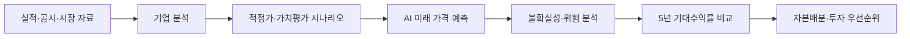

# 이성남 자산관리 · AI 투자분석 엔진

기업의 실적과 가치를 분석하고, AI가 예상한 미래 가격과 위험을 함께 비교하는 로컬 투자분석 프로젝트입니다. 목표는 **앞으로 5년 동안 어떤 자산에 자본을 배분할지 근거를 갖고 판단하는 것**입니다.

기업이 성장한다고 주식 수익률도 반드시 높아지는 것은 아닙니다. 매입가격, 주식 수 증가, 시장의 평가 변화까지 함께 살펴보도록 설계했습니다.

## 분석 흐름



위 흐름은 전체 설계입니다. AI 예측 엔진은 가치평가 뒤, 자본배분 비교 앞에 들어갑니다. 현재 브랜치의 AI 엔진은 독립 실행이 가능하며, 모든 분석 모드·시간별 브리핑·Top 10 선정에 자동 연결됐다고 검증한 상태는 아닙니다.

## 각 구성요소가 하는 일

| 구성요소 | 역할 | 현재 확인한 상태 |
|---|---|---|
| 기업 분석·가치평가 | 재무·경쟁력 분석과 적정가 계산 | 기존 런타임·스킬 제공; 근거 부족 시 조건부 또는 계산 불가 표시 |
| Chronos-2-small | 가격 시계열에서 미래 가격과 분위수 예측 | 실제 로컬 가중치로 12·60개월 추론 성공 |
| Kronos-mini | 시가·고가·저가·종가·거래량·거래대금으로 가격 예측 | 실제 모델·토크나이저로 12·60개월 추론 성공 |
| XGBoost / LightGBM | 설명된 재무·시장 특징으로 예측 모델 학습 | 합성 자료의 학습·저장·로드 검증; 금융 성능은 미검증 |
| Monte Carlo | 가정에 따른 결과 분포와 불확실성 계산 | 시나리오·앙상블과 연결; 독립적인 가격 예측 모델은 아님 |
| Ensemble | 가치평가와 사용 가능한 모델 결과 결합 | 시각·종목·통화·가격 기준이 맞는 결과만 결합 |
| FinCast | 향후 확장 후보 | 비활성화 |

`Top 10`은 투자 우선순위 상위 10개 후보라는 설계상의 의미입니다. 확정 매수 목록이나 자동 주문을 뜻하지 않습니다. 초기 모델 가중치는 실증적으로 최적화된 투자 전략이 아닙니다.

## 5년 전망을 읽는 방법

월봉 60단계는 5년 전망입니다. 현재 가격과 5년 뒤 예상 가격을 비교해 연평균 수익률(CAGR)을 계산합니다.

```text
예상 CAGR = (5년 뒤 예상 가격 / 현재 가격)^(1/5) - 1
```

현재 가격 100, 예상 가격 150이면 연평균 가격 수익률은 약 8.45%입니다. 계산 설명용 가상 예시이며 실제 종목 예측이 아닙니다. 현재 가격 전망은 배당을 포함한 총수익률과 구분해야 합니다.

**5년 가격을 출력할 수 있는 것과 그 가격을 정확히 맞히는 것은 다릅니다.** 실제 금융 자료의 기간 외 검증, 단순 기준 모델과의 비교, 장기 예측 오차 검증이 더 필요합니다.

## 시작하기

Windows PowerShell 예시입니다. Python 3.11 이상을 요구하며 이번 검증은 Python 3.12에서 진행했습니다.

```powershell
python -m venv .venv
$ProjectPython = (Resolve-Path .venv/Scripts/python.exe).Path
& $ProjectPython -m pip install -e .
& $ProjectPython scripts/sync_agent_skills.py --check
& $ProjectPython -m investment_stack --help
```

기본 설치는 분석 런타임 설치입니다. AI 추론에는 별도 패키지와 모델 가중치가 필요합니다. 가중치는 GitHub에 포함하지 않으며 각 PC에서 준비합니다.

실제 추론에 사용한 패키지는 `torch 2.14.1+cpu`, `chronos-forecasting 2.3.2`, `transformers 5.19.0`, `huggingface_hub 1.33.0`, `numpy 2.3.5`, `pandas 2.3.3`, `einops 0.8.1`입니다. `requirements-forecasting.txt`의 기본 ML 환경과 Chronos 환경은 Hub 버전 요구가 다를 수 있어 별도 가상환경에서 관리하세요.

필요한 패키지를 설치한 추론 환경에서 다음 명령을 사용합니다.

```powershell
# 고정된 모델 버전 다운로드 및 무결성 기록
& $ProjectPython scripts/bootstrap_pretrained_models.py --models-dir ./workspace/cache/pretrained-models

# 실행에 필요한 입력 확인
& $ProjectPython scripts/run_pretrained_forecast.py --help
```

예측에는 가격 DB, 종목, 통화, 모델 경로, 시간대가 포함된 분석 기준시각이 필요합니다. 가격 DB의 `prices_daily`는 관측시각·수집시각·수정주가 기준 등을 제공해야 합니다. 임의 CSV나 개인 자산 DB를 바로 넣을 수는 없습니다. 거래대금 등 필수 자료가 부족하면 해당 모델을 사용 불가로 표시합니다.

## 저장소 구성

| 경로 | 내용 |
|---|---|
| `runtime/investment_stack/` | 투자분석 실행 코드 |
| `runtime/investment_stack/forecasting/` | AI 어댑터, 앙상블, 시나리오, 무결성·저장 처리 |
| `skills/` | 8개 투자분석 스킬 원본 |
| `.agents/skills/` | Codex에서 읽는 스킬 미러 |
| `scripts/` | 모델 준비·예측 실행·모델 학습 도구 |
| `config/` | 명시적으로 선택해 사용하는 설정 자료 |
| `docs/` | 설계·구현 상태·최종 검증 기록 |

스킬을 수정하면 `scripts/sync_agent_skills.py`로 미러를 동기화합니다. 개인 자산 `personal.db`와 분석 실행 `run.db`는 분리합니다. 개인정보·인증정보·DB·가중치·캐시는 GitHub에 올리지 않습니다.

## 이번에 검증한 범위

2026-10-08 수정에서 Chronos의 시간대·실제 출력 형식·누락된 ID 차단과 Kronos 로딩 후 Python 경로·설정 복원을 보완했습니다.

- 정리 전 고정 소스의 전체 검사: **989개 통과, 2개 건너뜀, 206개 하위 검사 통과**.
- 실제 Chronos·Kronos 가중치: 합성 월봉 120개로 12·60개월 추론 성공.
- 한국 시간대 요청, 반복·초기화 로딩, 가중치·공식 소스 무결성 확인.
- 새 wheel·sdist 빌드 성공. 실제 금융 예측 정확도·GPU 성능은 미검증.

사용자 요청으로 GitHub에 게시하는 소스에서 테스트 파일, 일회성 검증 스크립트·로그를 제외했습니다. 로컬 원본과 Git 이력은 보존했습니다. 위 수치는 **정리 전 검증본의 기록**이며 게시된 트리에서 같은 테스트 명령을 실행할 수 있다는 뜻은 아닙니다.

[최종 모델 검증](docs/workflow/reviews/FORECAST-BROWSER-08-FINAL-VERIFY-20261008.md) · [독립 검토](docs/workflow/reviews/FORECAST-BROWSER-08-INDEPENDENT-REVIEW-20261008.md) · [설계](ARCHITECTURE.md) · [전체 구현 상태](IMPLEMENTATION_STATUS.md)

설계 버전 `v1.3`, 예측 패치 이름 `v7`, Python 패키지 버전 `0.1.0`은 서로 다른 구분입니다. 자동 주문을 실행하지 않습니다.
