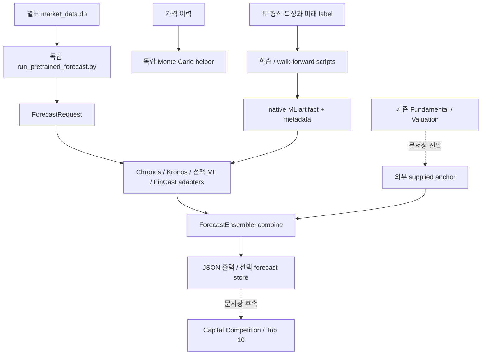

# AI Forecasting v7 설계 의도와 구현 감사

2026-10-08 KST / Codex. 원본 대상은 Downloads의 `lsn-forecasting-pretrained-bootstrap-patch-v7-20261006 (2)/v7_work`. 아래 판정은 수정 전 원본에 대한 감사이며 Gemini 수정본 승인 보고서가 아니다. 수정본은 별도 격리 branch/worktree에서 검토 중이다. 소프트웨어 감사와 실제 종목 투자 판단은 구별한다.

## A. 핵심 설계 의도

문서와 `orchestrator_hook.py`가 명시한 위치는 valuation 이후, capital competition 이전이다. 기업이 벌어들이는 현금과 성장의 가치를 먼저 평가하고, 시장가격이 앞으로 어떤 경로와 범위를 보일지 여러 모델로 보완하여 투자 후보의 수익·위험을 비교하려는 설계다. AI가 차트 하나로 기업의 본질적 가치를 대신 계산한다는 설계는 아니다.

본질적 가치는 사업·재무·현금흐름과 할인율 등의 가정으로 평가한 경제적 가치다. 미래 시장가격은 금리·심리·유동성·위험선호 및 실제 실적 변화가 반영된 거래가격이다. 좋은 기업이어도 현재 가격이 지나치게 높으면 투자 수익은 낮을 수 있다. 현재 매수가와 미래 가격을 연결한 CAGR 비교가 이 차이를 드러내려는 장치라는 해석은 코드의 terminal price와 future_cagr_5y 계산에 근거한 추론이다.

5년을 택한 재무적 이유를 코드가 모두 설명하지는 않는다. `horizon.plan_long_horizon()`은 다년 일봉의 단계 수와 오차 누적을 줄이려고 월말 빈도를 택한다고 명시한다. 실적 성장과 밸류에이션 정상화에 긴 기간을 주려는 투자 철학은 합리적인 해석이지만 실증 확인된 코드 사실로 단정할 수 없다.

## B. 기존 투자분석 스킬셋과의 관계

Fundamental은 사업·재무 및 경쟁력을 분석하고 Valuation은 적정가를 만든다. 예측 엔진은 그 결과를 덮어쓰지 않고 별도 모델 결과를 결합하도록 문서화됐다. Capital Competition은 후보 간 예상 수익과 위험을 비교하는 후속 단계다. 그러나 원본의 hook은 엔진 생성 함수이며 기존 7개 고정 모드·개별 종목 분석·시간별 브리핑에서 자동 호출되는 구현은 확인되지 않았다.

현재의 적정가가 할인된 현재가치인지, 5년 뒤 terminal value인지 구분하는 계약이 없었다. 따라서 현재 DCF 값을 5년 미래 시장가격과 바로 섞으면 경제적 기간이 다르다. 이 문제를 먼저 해결해야 스킬셋의 근거 기반 가치평가와 일관되게 연결할 수 있다.

## C. 모델별 역할

| 구성요소 | 실제 원본 입력·방식·대상 | 기대 역할과 현재 판정 |
|---|---|---|
| Chronos-2-small | `Chronos2Adapter.forecast()`: 가격 이력/timestamp와 선택적 covariates → `BaseChronosPipeline.predict_df()` → 마지막 예측값/분위수 | 사전학습 시계열 추론 어댑터 구현. 실행 가능한 실제 checkpoint와 금융 추론 성공 증거는 없음. 기간·레짐 변화와 covariate 미래 가정의 한계가 있음. |
| Kronos-mini | `KronosAdapter.forecast()`: OHLC 및 선택적 거래량/거래대금 → 토크나이저/모델/predictor → 마지막 close | 봉의 공동 움직임을 보완하려는 구조. 실제 금융 추론은 검증 불가. 결측 제거 뒤 timestamp 불일치, 로컬 소스 검증 및 출력 기간 확인이 부족함. |
| XGBoost | `train_tabular_forecaster.py`: 사용자가 지정한 표 특성 → 감독학습 → 미래5년 CAGR, 어댑터가 현재가에 CAGR을 적용 | 재무/거시 등 표 특성을 활용할 수 있으나 어떤 특성이 기업 경제성을 나타내는지는 데이터셋에 달림. 원본 검증 artifact는 합성 데이터이며 label 시점 누수로 OOS 성능을 신뢰할 수 없음. |
| LightGBM | 같은 표 특성·목표와 시간 분할, 다른 tree boosting 모델 및 native text artifact | XGBoost와 다른 학습 방식을 비교하는 역할. 별도 모델이라는 사실만으로 독립적인 투자 신호가 되지는 않음. 동일 데이터/목표의 오류를 공유할 수 있음. |
| FinCast | `FinCastAdapter`: 금융 시계열 bridge를 주입하거나 checkpoint 연결 | 기본 비활성. pickle checkpoint 승인/해시 경계 및 실제 bridge 연결이 필요. 이름과 wrapper 존재는 실제 사용 증거가 아님. |
| Monte Carlo | `simulate_terminal_distribution()`: 역사 log-return 표준편차와 지정 terminal median으로 정규 충격 시뮬레이션 | 조건부 terminal 범위/손실확률. 사업 시나리오나 실제 calibrated AI 분포를 자동 추정하지 않으며 원본 엔진과 연결되지 않음. |
| Ensemble | `ForecastEnsembler.combine()`: terminal point들을 bootstrap prior와 reliability로 가중 기하평균 | 펀더멘털 중심 대표값. 원본은 시나리오를 분위수로 바꾸고 서로 다른 구성의 분위수를 평균하므로 최종 calibrated uncertainty로 해석하면 안 됨. |

raw priors는 anchor .60, Chronos .20, Kronos .15, FinCast .05, XGBoost/LightGBM 각각 .10이다. 실제 활성 component만 정규화하므로 60%를 항상 유지하는 정책이 아니다. 이 값들은 초기값이며 최적 가중치 검증 결과가 아니다.

## D. 실제 데이터 흐름

점선은 설계상 연결이며 원본의 자동 실행 연결을 뜻하지 않는다. 원본 `engine.run()`은 어댑터 호출→앙상블→선택 저장을 실행한다. MC·기대 CAGR·투자 순위까지 하나의 실행으로 완성하지 않는다.

## E. 5년 가격·적정가·기대 CAGR

월봉60단계는 5년 경로를 표현하는 방법이다. 60단계를 출력할 수 있다는 사실은5년 뒤 가격의 정확성을 증명하지 않는다. 원본 adapter는 모델이 경로를 반환해도 마지막 가격 중심으로 저장한다.

가격 대표값 P5와 현재가 P0에서 `(P5/P0)^(1/5)-1`은 대표 가격의 연환산 수익률이다. 이것이 통계적 기대 CAGR은 아니다. 실제 terminal samples가 있으면 기대 누적수익률은 `mean(P5/P0-1)`, 기대 CAGR은 `mean((P5/P0)^(1/T)-1)`이다. `CAGR(mean(P5))`와 `mean(CAGR(P5))`는 비선형성 때문에 다르다. 배당·세금·FX·비용이 없으면 가격 수익률로만 표시해야 한다.

계산 설명용 가상 예: 현재100,5년 미래 시나리오150이면 대표 CAGR은 약8.45%다. 이는 실제 기업의 전망이나 모델 결과가 아니다. 현재 적정가150을 미래150으로 대체해 같은 수치를 만들면 기간 의미가 달라져 잘못된 결합이다.

매출 성장·마진·FCF·ROIC·희석·multiple 변화를 원본 엔진이 자체 재무 모델로 추정하지 않는다. supplied anchor나 ML 특성에 반영됐을 때만 간접 반영된다. 원본이 이 요소들을 통합적으로 계산한다고 설명하면 과장이다. 수정 계약에는 terminal 매출/성장/마진/multiple/net debt/fully diluted shares의 명시적 산식을 추가하도록 지정했다.

## F. 강점과 구조적인 약점

강점은 모델 교체 가능한 adapter, 기본 FinCast 비활성, native tabular serialization, bootstrap provenance 시도, 모델 결과와 가치평가를 구별하려는 구조다. 다양한 모델을 비교할 틀은 마련됐다.

약점은5년 label 관측시점 누수, 가격 조정/기준일 부정합, 현재가치와 미래가치 혼합, 불확실성 보정 부재, 모델 오류 전파 및 실전 평가 부족이다. 모델이 많아도 오류가 상관되면 앙상블 효과는 제한된다. 역사 변동성을 반복하는 MC는 사업 실패·증자·구조 변화·금리 레짐을 자동 포착하지 않는다. 따라서 정교한 출력이 검증된 확률이라는 인상을 주지 않도록 해야 한다.

## G. 현재 원본 완성도

| 질문 | 판정 | 근거 |
|---|---|---|
| 독립 패치 / authoritative v7 완전 통합 | 독립 패치 구현, 전체 통합 미확인 | hook/runner는 존재하나 기존 실행 모드 연결 없음. 별도 authoritative ZIP 접근 불가. |
| pretrained weights 준비 | 제공 ZIP에는 없음 | checkpoint 확장자 파일 없음, bootstrap 로그는 다운로드 이전 DNS 실패. |
| Chronos/Kronos 실제 금융 추론 | 검증 불가 | 성공 추론 로그/실제 weights가 제공되지 않음. |
| ML 금융 학습 | 합성 학습만 확인 | SYN000 패널/metadata. 실제 금융 학습 성공 증거 없음. |
|53개 원본 tests | 구조 검증 구현/직접 재실행 확인 | 깨끗한 검토 환경에서53 passed in8.14s. 금융 정확도·실제 inference·5년 OOS를 증명하지 않음. |
|미국/한국/일본 자동 데이터 수집 | 부분 구현/실행 검증 부족 | 외부 collector 코드와 provider 구조는 존재하지만 실제 시장별 자동 수집 성공을 이번 감사에서 실행하지 않음. |
|개별 분석/1시간 브리핑 자동 실행 | 미구현 또는 확인 불가 | 현재 저장소 호출 연결 없음. |
|MC/return/risk/Capital Competition E2E | 미구현 | 원본은 독립 helper와 문서 연결에 머무름. |

ZIP116파일이 추출본과 일치하고 CRC 확인됐다. 요청된 `forecasting-pretrained-bootstrap-v7-verification-20261006.md`, `lsn-asset-mng-skills-v7-final-verified-20261005.zip`은 지정 자료 범위에서 찾지 못했다. 이 파일 내용이나 그 검증 결과를 추측하지 않는다.

## H. 의도 대비 부족한 점과 보완 순서

1. 입력/출력에 instrument·currency·analysis as-of·target date·horizon·price basis·semantics를 결속하고 현재 DCF와 terminal scenario를 구분한다.
2. 실제 학습 경로에서 feature publication 및 label availability를 fit cutoff로 purge하고 supervised5년 target을 다른 기간에 재사용하지 못하게 한다.
3. historical retrieval cutoff·완료 월봉·동일 공급자/조정 방식·모델 출력 timestamp를 일관되게 확인한다.
4. 계산 상태와 empirical validation을 분리하고, 누락 지표를 좋은 성능으로 대신하거나 scenario를 statistical quantile로 표기하지 않는다.
5. local-only integrity를 load 직전에 검증하고 모델별 오류를 격리하며 assessment와 provenance를 저장한다.
6. 합성 E2E 뒤 실제 pretrained 추론과 point-in-time 실제 데이터 OOS를 수행한다.5년 label 지연을 고려한 충분한 역사·대상 universe·비교 baseline 및 survivorship/상장폐지 처리가 필요하다.
7. 실증 검증을 통과한 계약을 기존 valuation/보고서/Capital Competition과 연결하고 ranking 허용 조건을 확정한다. 이번 수정 배치가 자동 Top10/시간별 실행까지 완료하는 것은 아니다.

## I. 최종 결론

이 엔진의 목적은 가치평가에 시장가격의 미래 경로와 조건부 위험 정보를 더하여 후보 주식의5년 수익·위험 비교를 체계화하는 것이다. 완성되면 “좋은 회사인가”와 “현재 가격에서 좋은 투자 후보인가”를 더 명확히 구분할 수 있다. 원본은 그 틀의 초기 실험용 구현이며,5년 전망의 신뢰성을 보장하는 완성된 투자 판단 엔진은 아니다. 현재 Gemini 수정본은 Codex 설계 계약 및 독립 반례 검증을 거쳐야 수락할 수 있다.
